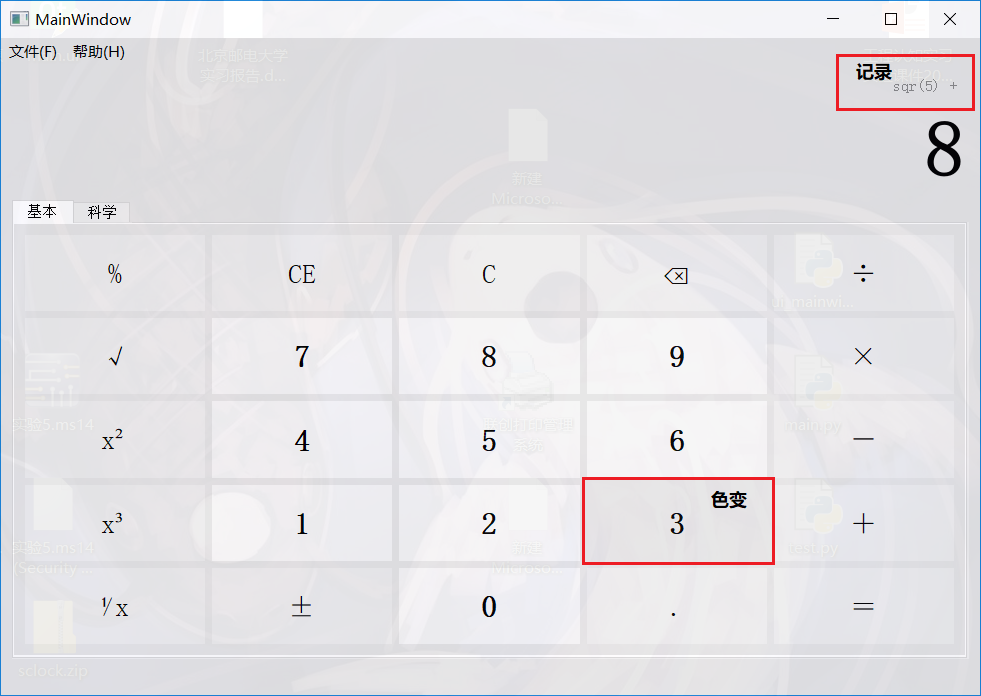
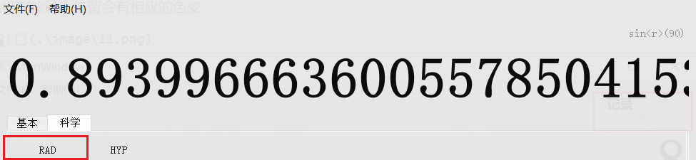

# 计算器的实现

**基于Qt和Python实现的仿win10计算器**

## 一、实验目的和要求

1. 具有加减乘除、乘方、开方、对数、指数、三角函数、取余、阶乘等基本运算功能；

2. 至少包含standard calculator和scientific calculator两种**GUI**界面。

## 二、实验过程

1. 小组分工

| 姓名                | 主要任务（主要负责方面，各任务间有配合穿插）       | 贡献度 |
| ------------------- | -------------------------------------------------- | ------ |
| 杨沛然              | 统筹规划，技术担当，技术指导，负责两部分工作的对接 | 28%    |
| 王江                | standard calculator的代码实现                      | 12%    |
| 韩放                | standard calculator的代码测试与debug               | 12%    |
| 李雨龙              | standard calculator的GUI界面设计                   | 12%    |
| 钟星宇              | scientific calculator的GUI界面设计                 | 12%    |
| 朱文武              | scientific calculator的代码实现                    | 12%    |
| 沙力塔那提·奥吾列汗 | scientific calculator的代码测试与debug             | 12%    |

2. 程序设计截图

   

## 三、实验结果

成功满足了所有要求，界面简单大方，功能更加齐全

增设了历史输入记录的小版块（便于检查输入）

鼠标在按键上停留会有相应的色变

弧度制与角度制的转换

三角函数与双曲函数的转化

## 四、遇到问题及解决办法

1. 在GUI界面的设计上莫衷一是

   解决方案：最终敲定使用Qtdesigner来设计GUI界面

2. 无法实现计算器界面的半透明效果

   解决方案：在文档中找到解决办法[https://doc.qt.io/qt-5/mainwindow.html]

3. 无法进行2147483647的大数运算

   解决方案：使用python的Decimal（十进制高精度大数运算）库

4. 设计初期遗漏了从键盘输入的情况，只能用鼠标进行操作

   后期将按键与回调函数进行绑定

   

## 五、程序的不足之处

1. 无法实现计算器界面的磨砂效果

3. 没有实现对小括号的功能

